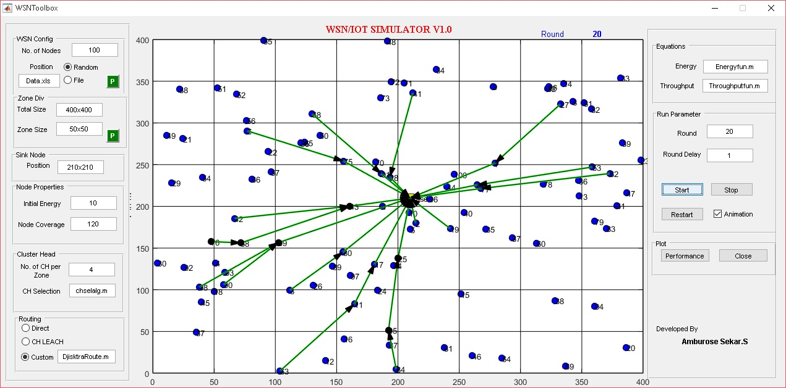

# WSNsimulatorMatlab
Develop Simple and Efficient WSN Simulator for Researchers Version 1.0

## Details
   Develop Common GUI with basic Netowrk Paremeters with Custom made function.
   1. Easy to apply different Protocol
   2. Easy to update in Realtime Case
### Video Link
### Future Work
1. Need to update Document
2. Need to Update Zone based Cluster Head Selection
3. Need to Update Different Routing Protocol
